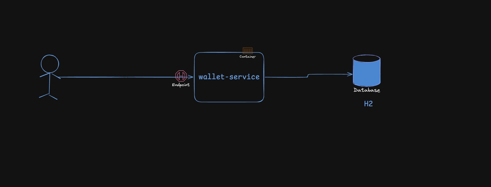

# wallet-service
Service responsible for management of users wallets, enabling basic operations in their wallets, such as: creation of multiple wallet, retrieve current/historical wallet balance, deposit/withdraw funds and transfer between wallets.

## Starting

We need to install java 21 jdk, for now on this project GraalVM was not tested

https://sdkman.io/

https://www.oracle.com/java/technologies/downloads/#java21


```Bash
$ ./mvnw spring-boot:run

```

### Docker

```Bash
$ ./mvnw  install -DskipTests
$ docker build -t wallet-service -f Docker.dockerfile .
$ docker run -p 8080:8080 wallet-service
```

### Running tests

```Bash
$ ./mvnw test
```

### Accessing H2 DB

http://localhost:8080/api/wallet-service/v1/h2-console

configs available on `application.properties`

### Api Swagger contract

http://localhost:8080/api/wallet-service/v1/contract.html

## Architectural Decisions

### Why Java with Spring Boot/Maven

My decision of using Java was made cause is my main currently language and has a fit with Recarga pay stack, which was also my decision for using spring boot, although other modern and recent frames like Quarkus or Micronaut also could be used for this type of container microservice application. 

### Service Architecture

I chose Clean Arch cause of its ease in dealing with decoupling with its use of port/adapters interface, making it easy to change in the future, like the replacement of database types. Another reason is the simplicity to Stub/Mocking implementations, allowing a much easier setup of unit/integration tests.

### Designs:




## Challenges

### Api and Database definitions

### Which Database should i use? 

 My choice was H2 database, that is a simple relational database for the given time scope and we can maintain a well structure between the wallets, has ACID operations that is a must requirement for transactional solutions like this and we can store the transactional history of each wallet without problems.

 ### Trade-off time scope, but will be necessary

 - H2 database for production environment is not commonly a good choice, we can replace further for a PostgreSQL solution, that is a open source database well known for his performance and multi cloud compatibility
- Integration/Component tests with `WireMock`, `Testcontainers`, avoiding manual contract tests at every infrastructure change
- Security: none Api security layer was implemented but it will be necessary a oauth2 with scope level access
- Use of DB transactions(commit/rollback) in case of any error occur during an order
- Improvement in exception handling, i am only using RuntimeException with 500 http status